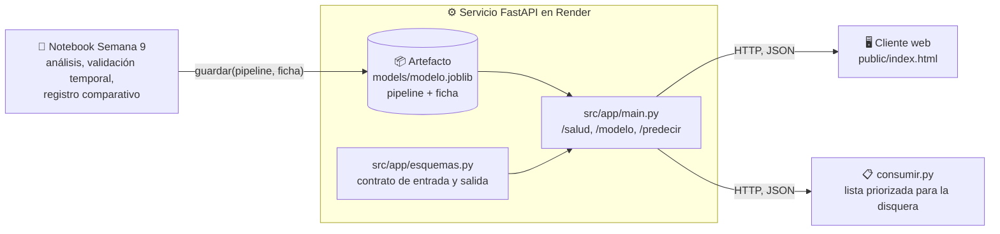

<div align="center">

# Predicción de popularidad de canciones: del análisis al uso

Repositorio de referencia para un taller práctico sobre regresión lineal

[](https://www.python.org)
[](https://fastapi.tiangolo.com)
[](https://scikit-learn.org)
[](https://render.com)

**[🌐 Demo en vivo](https://prediccion-canciones.onrender.com)** |
**[📖 Guía de despliegue](docs/DESPLIEGUE.md)** |
**[🔬 Contrato del artefacto](docs/ARTEFACTO.md)**

</div>

---

Servicio mínimo que toma el modelo de regresión construido en el notebook de la Semana 9 y lo convierte en algo que otros pueden usar sin repetir el análisis: un **artefacto** (el pipeline junto con su **ficha**) y un **servicio HTTP** que responde, para cada canción, cuál es su popularidad esperada y si conviene promocionarla. El notebook termina en un registro comparativo; este repositorio empieza donde el notebook termina.

> **La idea central:** el modelo es un insumo; la decisión es el producto. El servicio no calcula ninguna decisión por su cuenta: el corte de promoción, el error esperado y las variables excluidas viajan en la ficha, dentro del artefacto. Cambiar el modelo es cambiar el artefacto; el servicio y el cliente no se tocan.

Su trabajo consiste en **reemplazar el artefacto por el suyo**, con la ficha respaldada por la evidencia de su propio análisis, y **publicar el servicio** en Render.

## Del notebook a la decisión



La dirección de las flechas es la regla: el análisis produce el artefacto, el artefacto alimenta al servicio y el servicio alimenta a quien decide. Nada viaja en sentido contrario. El cliente nunca ve el modelo, solo la ficha y las predicciones; el servicio nunca ve los datos de entrenamiento, solo el artefacto.

### ¿Dónde vive cada cosa del análisis?

| En el notebook era... | Ahora vive en... | Por qué ahí |
|---|---|---|
| Columnas de entrada, variables derivadas (`duracion_c2`) | `src/variables.py` | El servicio y el entrenamiento deben coincidir exactamente |
| Preprocesamiento + estimador | el `pipeline` dentro del artefacto | Lo que se entrena es lo que se despliega, sin pasos sueltos |
| Registro comparativo, línea base, MAE, sesgo, límites | la `ficha` dentro del artefacto | El modelo viaja con su sustento; `GET /modelo` lo expone |
| Corte de promoción (60 / 65 / 70) | `ficha["decision"]` | La regla es parte del análisis, no del código del servicio |
| Verificación de que todo cuadra | `src/artefacto.py` (`guardar` / `cargar`) | El contrato se comprueba antes de escribir el archivo |
| "¿Qué canciones promocionamos?" | `consumir.py` -> `salidas/lista_promocion.csv` | La lista es el producto; el servicio es el medio |

El contrato completo del artefacto y cómo reemplazarlo está en [`docs/ARTEFACTO.md`](docs/ARTEFACTO.md).

## API

| Método | Ruta | Qué devuelve | Respuestas |
|--------|------|--------------|-----------|
| `GET` | `/` | Cliente web (`public/index.html`) | `200` |
| `GET` | `/salud` | Si el servicio está arriba y qué modelo cargó | `200` |
| `GET` | `/modelo` | La **ficha**: qué predice, con qué datos, qué tan bien y qué decisión sostiene | `200`, `503` sin modelo |
| `POST` | `/predecir` | Para una canción: popularidad esperada, rango (± MAE), corte y decisión | `200`, `422` entrada inválida, `503` sin modelo |
| `POST` | `/predecir_lote` | Lo mismo para hasta 1.000 canciones | `200`, `413` lote demasiado grande, `422`, `503` |

La documentación interactiva (Swagger) queda en `/docs`. Ejemplo de respuesta de `/predecir`:

```json
{"tarea": "regresion", "modelo": "lineal + duración² (2026-09-27)",
 "popularidad_esperada": 84.8, "rango": [79.1, 90.6], "corte_promocion": 65.0,
 "promocionar": true, "explicacion": "popularidad esperada 84.8 (±5.75) supera el corte 65"}
```

La entrada se valida contra `src/app/esquemas.py` (rangos de cada variable, géneros permitidos): un `422` significa que la canción no cumple el contrato, no que el modelo falló. Si el artefacto cargado es de clasificación, la misma ruta devuelve `probabilidad_hit`, `umbral` y la decisión; el cliente y `consumir.py` ya saben leer ambas formas.

## Estructura del proyecto

```
prediccion-canciones/
├── src/
│   ├── variables.py             # Columnas de entrada y variables derivadas
│   ├── artefacto.py             # guardar() / cargar(): el contrato del artefacto
│   ├── entrenar.py              # Reproduce el modelo del notebook y escribe el artefacto
│   └── app/
│       ├── esquemas.py          # Contrato HTTP de entrada y salida (Pydantic)
│       └── main.py              # Servicio FastAPI: carga el artefacto una vez y expone rutas
├── models/modelo.joblib         # Artefacto: pipeline + ficha   <- lo que usted reemplaza
├── data/canciones.csv           # 2.000 canciones sintéticas, 1995-2025
├── public/index.html            # Cliente web: pide la ficha y predice; no contiene el modelo
├── consumir.py                  # Cliente en lote: produce salidas/lista_promocion.csv
├── probar_servicio.py           # Prueba de humo contra un servicio desplegado
├── tests/test_servicio.py       # Pruebas del servicio (pytest)
├── requirements.txt             # Versiones fijadas: el artefacto se crea con estas
├── render.yaml, Procfile       # Despliegue en Render con un clic
├── semana_10/                   # Siguiente paso del curso (ver Ruta del curso)
└── docs/                        # DESPLIEGUE.md, ARTEFACTO.md
```

## Ejecución local y despliegue

```bash
git clone https://github.com/SU_USUARIO/prediccion-canciones.git
cd prediccion-canciones
python -m venv venv && source venv/bin/activate     # Windows: venv\Scripts\activate
pip install -r requirements.txt

python -m src.entrenar        # entrena y escribe models/modelo.joblib con su ficha
pytest -q                     # 7 pruebas deben pasar
uvicorn src.app.main:app --reload --port 8000        # -> http://127.0.0.1:8000
```

En otra terminal, con el entorno activo:

```bash
python consumir.py            # canciones 2020-2025 -> salidas/lista_promocion.csv
python probar_servicio.py     # prueba de humo (la misma que se usa para calificar)
```

En Render: **New +** -> **Blueprint** -> su fork -> **Apply**. Render lee `render.yaml` y cada `git push` vuelve a desplegar. Guía completa, plan gratuito, plan B y errores frecuentes: [`docs/DESPLIEGUE.md`](docs/DESPLIEGUE.md).

## Nota sobre versiones

El artefacto es un objeto de scikit-learn serializado: solo se garantiza que cargue con la **misma versión** con que se creó. Por eso `requirements.txt` fija versiones y `cargar()` avisa si no coinciden. Si entrena en Colab, instale primero `pip install -r requirements.txt` allí; si entrena en su máquina, hágalo dentro del `venv` del repositorio. Un `.joblib` que carga en su portátil y falla en Render casi siempre es una diferencia de versión.

## Ruta del curso

| Semana | Tema | Este repositorio |
|--------|------|------------------|
| **9** | Regresión e IA para analítica | ✅ Artefacto de regresión (`popularidad`) con ficha y corte de promoción; servicio y cliente |
| **10** | Clasificación | 🔜 Mismo servicio, otro artefacto: `es_hit`, umbral y costos de error (`semana_10/`) |

El servicio, el cliente y las pruebas no cambian entre semanas: cambia el artefacto. Ese es el punto.

---

<div align="center">
<sub>Universidad Central, Ingeniería de Sistemas, Data Analytics, 2026-2. Prof. Elias Buitrago Bolivar</sub>
</div>
