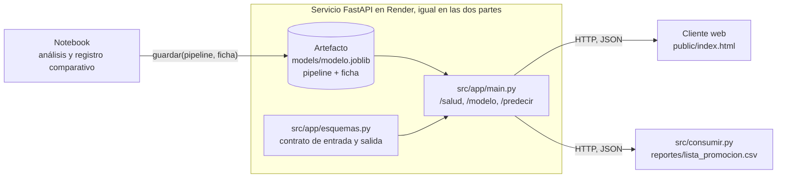

<div align="center">

# Predicción de popularidad de canciones: del análisis al uso

Repositorio de referencia para un taller práctico sobre regresión lineal, encadenado con clasificación binaria

[](https://github.com/ebuitrago/prediccion-canciones/actions/workflows/ci.yml)
[](https://www.python.org)
[](https://fastapi.tiangolo.com)
[](https://scikit-learn.org)
[](https://render.com)
[](LICENSE)

**[Demo en vivo](https://prediccion-canciones.onrender.com)** |
**[Guía de despliegue](docs/DESPLIEGUE.md)** |
**[Contrato del artefacto](docs/ARTEFACTO.md)** |
**[Diccionario de datos](docs/DATOS.md)**

</div>

---

Una disquera debe decidir, antes del lanzamiento, en qué canciones invertir promoción. El taller aborda esa decisión en dos partes que comparten el caso, los datos y el servicio de predicción:

- **Parte 1, regresión lineal.** Se predice la popularidad que alcanzará cada canción, de 0 a 100, y se recomienda promocionarla si la predicción supera un corte.
- **Parte 2, clasificación binaria.** El objetivo pasa a ser `es_hit` (sí o no) y se recomienda promocionar si la probabilidad de hit supera un umbral, que se deriva del costo de cada tipo de error.

Los criterios de la parte 1 (momento de la predicción, control de fuga, línea base, validación temporal y ficha del modelo) se aplican sin cambios en la parte 2. Entre una parte y otra solo cambia el artefacto.

El repositorio toma el modelo construido en el notebook y lo convierte en algo que otras personas pueden usar sin repetir el análisis: un artefacto, que reúne el pipeline con su ficha, y un servicio HTTP que responde, para cada canción, la predicción y la decisión que sostiene.

Su trabajo en cada parte consiste en reemplazar el artefacto por el suyo, con una ficha respaldada por la evidencia de su análisis, y publicar el servicio en Render.

## Principio de diseño

El servicio no contiene reglas de negocio propias. La tarea, la regla de decisión (el corte en la parte 1, el umbral en la parte 2), el error esperado y las variables excluidas se leen de la ficha del artefacto. En consecuencia, el servicio, el cliente web y las pruebas son los mismos en las dos partes, y cambiar de modelo equivale a cambiar un archivo.

## Las dos partes del taller

| | Parte 1: regresión lineal | Parte 2: clasificación binaria |
|---|---|---|
| Pregunta de negocio | ¿Qué popularidad alcanzará la canción? | ¿La canción será un hit? |
| Objetivo | `popularidad` (0 a 100) | `es_hit` (1 si la popularidad llega a 70) |
| Variables de entrada | Las 10 de `COLUMNAS_ENTRADA` | Las mismas 10 |
| Variables excluidas por fuga | `reproducciones_sem1` (posterior al lanzamiento), `es_hit` (se calcula del objetivo) | `reproducciones_sem1` (posterior al lanzamiento), `popularidad` (define el objetivo) |
| Modelo de referencia | `LinearRegression` con duración² | `LogisticRegression` |
| Línea base | Media de popularidad por género | Predecir siempre "no hit" |
| Métricas | MAE, RMSE, R², sesgo, error por género | Precisión, exhaustividad (recall), matriz de confusión, costo total de los errores |
| Resultado de referencia en 2020-2025 | MAE 5,75 frente a 10,44 de la línea base | Costo 99 frente a 318 de la línea base |
| Regla de decisión | Promocionar si la popularidad esperada supera el corte | Promocionar si la probabilidad de hit supera el umbral |
| Origen de la regla | Quien responde por el presupuesto fija el corte (60, 65 o 70) | Quien responde por el presupuesto fija los costos (falso negativo 3, falso positivo 1); el umbral es el que minimiza el costo |
| Respuesta de `/predecir` | `popularidad_esperada`, `rango`, `corte_promocion` | `probabilidad_hit`, `umbral` |
| Entrenamiento | `python -m src.entrenar_regresion` | `python -m src.entrenar_clasificacion` |

La validación es temporal en ambas partes: se entrena con las canciones de 1995 a 2019 (1.585) y se evalúa con las de 2020 a 2025 (415), porque la disquera siempre predice canciones que aún no se han lanzado. En la parte 2 el umbral se elige con probabilidades fuera de muestra dentro del periodo de entrenamiento, de modo que el periodo de prueba no interviene en ninguna decisión. Las probabilidades de la regresión logística no están calibradas; revisarlo forma parte del análisis de la parte 2.

## Del notebook a la decisión



Las flechas van en un solo sentido: el análisis produce el artefacto, el artefacto alimenta al servicio y el servicio alimenta a quien decide. El cliente no ve el modelo, solo la ficha y las predicciones; el servicio no ve los datos de entrenamiento, solo el artefacto.

### Correspondencia entre el notebook y el repositorio

| En el notebook | En el repositorio | Motivo |
|---|---|---|
| Columnas de entrada y variable derivada `duracion_c2` | `src/variables.py` | El entrenamiento y el servicio deben usar exactamente las mismas |
| Rutas, semilla, año de corte, corte de promoción, costos de error | `src/config.py` | Un solo lugar para los parámetros del análisis |
| Carga y partición temporal | `src/datos.py` | Las dos partes usan la misma partición |
| Preprocesamiento y estimador | `pipeline` dentro del artefacto | Lo que se evalúa es lo que se despliega |
| Registro comparativo, línea base, métricas, límites | `ficha` dentro del artefacto | El modelo viaja con su evidencia; `GET /modelo` la expone |
| Corte de promoción o costos y umbral | `ficha["decision"]` | La regla es parte del análisis, no del código del servicio |
| Lista de canciones a promocionar | `reportes/lista_promocion.csv` | Es el resultado que usa la disquera |

## API

| Método | Ruta | Respuesta | Códigos |
|--------|------|-----------|---------|
| `GET` | `/` | Cliente web (`public/index.html`) | `200` |
| `GET` | `/salud` | Estado del servicio, modelo y tarea cargados | `200` |
| `GET` | `/modelo` | Ficha: qué predice, con qué datos, qué tan bien y qué decisión sostiene | `200`, `503` sin modelo |
| `POST` | `/predecir` | Predicción y decisión para una canción, según la tarea cargada | `200`, `422` entrada inválida, `503` sin modelo |
| `POST` | `/predecir_lote` | Lo mismo para hasta 1.000 canciones | `200`, `413` lote demasiado grande, `422`, `503` |

La documentación interactiva está en `/docs`. La misma canción recibe una respuesta distinta según el artefacto cargado.

Parte 1, artefacto de regresión:

```json
{"tarea": "regresion", "modelo": "lineal + duración² (2026-09-27)",
 "popularidad_esperada": 84.8, "rango": [79.1, 90.6], "corte_promocion": 65.0,
 "probabilidad_hit": null, "umbral": null,
 "promocionar": true, "explicacion": "popularidad esperada 84.8 (±5.75) supera el corte 65"}
```

Parte 2, artefacto de clasificación:

```json
{"tarea": "clasificacion", "modelo": "logística + umbral por costos (2026-09-27)",
 "popularidad_esperada": null, "rango": null, "corte_promocion": null,
 "probabilidad_hit": 0.979, "umbral": 0.27,
 "promocionar": true, "explicacion": "probabilidad de hit 0.98 supera el umbral 0.27"}
```

`tarea`, `modelo`, `promocionar` y `explicacion` siempre tienen valor; los campos de la otra tarea llegan en `null`. La entrada es la misma en las dos partes y se valida contra `src/app/esquemas.py`: rango de cada variable, géneros permitidos y ningún campo adicional. Enviar `reproducciones_sem1`, `popularidad` o `es_hit` produce `422`, porque el contrato solo admite lo que existe en el momento de decidir.

## Estructura del proyecto

```
prediccion-canciones/
├── .github/workflows/ci.yml       # Integración continua: ruff y pytest en cada push
├── data/canciones.csv             # 2.000 canciones sintéticas, 1995-2025 (ver docs/DATOS.md)
├── docs/                          # ARTEFACTO.md, DATOS.md, DESPLIEGUE.md
├── models/modelo.joblib           # Artefacto: pipeline + ficha, el archivo que usted reemplaza
├── notebooks/
│   └── 01_regresion_popularidad.ipynb   # Análisis de la parte 1
├── public/index.html              # Cliente web: muestra la ficha y predice
├── reportes/                      # Entregables generados: registro comparativo y lista de promoción
├── src/
│   ├── config.py                  # Rutas y parámetros del análisis
│   ├── datos.py                   # Carga y partición temporal
│   ├── variables.py               # Columnas de entrada, variables derivadas y preprocesamiento
│   ├── artefacto.py               # guardar() y cargar(): el contrato del artefacto
│   ├── entrenar_regresion.py      # Parte 1: entrena la regresión y escribe el artefacto
│   ├── entrenar_clasificacion.py  # Parte 2: entrena el clasificador, elige el umbral y escribe el artefacto
│   ├── consumir.py                # Cliente en lote: produce la lista de promoción
│   ├── probar_servicio.py         # Prueba de humo contra un servicio en ejecución
│   └── app/
│       ├── esquemas.py            # Contrato HTTP de entrada y salida (Pydantic)
│       └── main.py                # Servicio FastAPI
├── tests/                         # Pruebas de datos, variables, artefacto y servicio
├── Makefile                       # Atajos para los comandos frecuentes
├── pyproject.toml                 # Metadatos y configuración de ruff y pytest
├── render.yaml, Procfile          # Despliegue en Render
├── requirements.txt               # Dependencias del servicio, con versiones fijas
└── requirements-dev.txt           # Dependencias de desarrollo, pruebas y notebook
```

## Puesta en marcha

Preparación, una sola vez, desde la raíz del repositorio:

```bash
git clone https://github.com/SU_USUARIO/prediccion-canciones.git
cd prediccion-canciones
python -m venv .venv
source .venv/bin/activate          # Windows: .venv\Scripts\activate
pip install -r requirements-dev.txt
```

Parte 1, regresión lineal:

```bash
python -m src.entrenar_regresion   # escribe models/modelo.joblib con la regresión y su ficha
pytest                             # todas las pruebas deben pasar
uvicorn src.app.main:app --reload --port 8000
```

En otra terminal, con el entorno activo:

```bash
python -m src.probar_servicio      # prueba de humo, la misma que se usa para calificar
python -m src.consumir             # reportes/lista_promocion.csv, ordenada por popularidad esperada
```

Parte 2, clasificación binaria, con el mismo servicio:

```bash
python -m src.entrenar_clasificacion   # reemplaza models/modelo.joblib con el clasificador y su ficha
pytest
uvicorn src.app.main:app --reload --port 8000
python -m src.probar_servicio
python -m src.consumir                 # la lista se ordena ahora por probabilidad de hit
```

Para volver a la parte 1 basta con ejecutar de nuevo `python -m src.entrenar_regresion`. Conserve un commit por cada artefacto: el historial de git es la evidencia de las dos entregas.

En Linux, macOS o Codespaces, `make regresion`, `make clasificacion`, `make probar`, `make lint` y `make servir` ejecutan los mismos comandos.

Para publicar el servicio en Render, cree un Blueprint desde su fork: Render lee `render.yaml` y cada `git push` a `main` vuelve a desplegar, así que pasar de la parte 1 a la parte 2 en producción consiste en hacer push del nuevo artefacto, sin cambiar la URL. Los pasos, los límites del plan gratuito, la alternativa con Codespaces y la lista de entregables están en [`docs/DESPLIEGUE.md`](docs/DESPLIEGUE.md).

## Calidad y reproducibilidad

| Práctica | Implementación |
|---|---|
| Versiones fijas | `requirements.txt` para el servicio y `requirements-dev.txt` para desarrollo. El artefacto guarda las versiones con que se creó y `cargar()` avisa si no coinciden con las del entorno. |
| Semilla y partición fijas | `SEMILLA` y `ANIO_CORTE` en `src/config.py`; la partición temporal está en `src/datos.py`. |
| Pruebas automáticas | `tests/test_datos.py` revisa el CSV (nulos, duplicados, rangos, coherencia de `es_hit`); `test_variables.py`, que no haya variables posteriores entre las entradas; `test_artefacto.py`, el contrato de la ficha y que el modelo supere su línea base; `test_servicio.py`, las rutas y el rechazo de entradas inválidas. |
| Estilo | `ruff check .` con la configuración de `pyproject.toml`, también sobre el notebook. |
| Integración continua | `.github/workflows/ci.yml` ejecuta el estilo y las pruebas en cada push y pull request. |
| Rutas independientes de la carpeta de trabajo | `src/config.py` resuelve las rutas desde la raíz del repositorio. |

## Ruta del taller

| Fase | Tema | Estado | Contenido en el repositorio |
|--------|------|--------|-----------------------------|
| 1 | Regresión e IA para analítica | Disponible | Parte 1: notebook, artefacto de regresión con ficha y corte de promoción, servicio, cliente y despliegue |
| 2 | Clasificación binaria | Siguiente | Parte 2: el mismo servicio publicado con otro artefacto (`es_hit`, costos de error y umbral) |

## Licencia

El código se distribuye bajo licencia MIT (ver [`LICENSE`](LICENSE)). Los datos de `data/canciones.csv` son sintéticos y se generaron para este taller.

---

<div align="center">
<sub>Universidad Central, Ingeniería de Sistemas, Data Analytics, 2026-2. Prof. Elias Buitrago Bolivar</sub>
</div>
