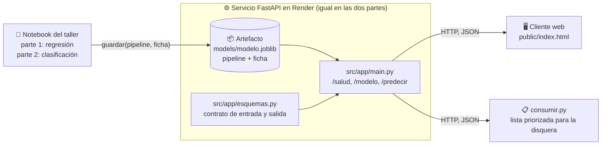

<div align="center">

# Predicción de popularidad de canciones: del análisis al uso

Repositorio de referencia para un taller práctico sobre regresión lineal, encadenado con clasificación binaria

[](https://www.python.org)
[](https://fastapi.tiangolo.com)
[](https://scikit-learn.org)
[](https://render.com)

**[🌐 Demo en vivo](https://prediccion-canciones.onrender.com)** |
**[📖 Guía de despliegue](docs/DESPLIEGUE.md)** |
**[🔬 Contrato del artefacto](docs/ARTEFACTO.md)**

</div>

---

Taller en dos partes sobre el mismo caso, los mismos datos y el mismo servicio. Una disquera debe decidir, antes del lanzamiento, en qué canciones invertir promoción. En la **parte 1 (regresión lineal)** se predice la popularidad que alcanzará cada canción, un número entre 0 y 100, y se promociona si la predicción supera un corte. En la **parte 2 (clasificación binaria)** el objetivo pasa a ser `es_hit`, sí o no, y se promociona si la probabilidad de hit supera un umbral que se deriva del costo de cada tipo de error. Lo trabajado en la parte 1 (momento de la predicción, control de fuga, línea base, validación temporal, ficha del modelo) se reutiliza sin cambios en la parte 2; lo único que cambia es el artefacto.

El repositorio toma el modelo construido en el notebook y lo convierte en algo que otros pueden usar sin repetir el análisis: un **artefacto** (el pipeline junto con su **ficha**) y un **servicio HTTP** que responde, para cada canción, cuál es la predicción y qué decisión sostiene. El notebook termina en un registro comparativo; este repositorio empieza donde el notebook termina.

> **La idea central:** el modelo es un insumo; la decisión es el producto. El servicio no calcula ninguna decisión por su cuenta: la regla (el corte en la parte 1, el umbral en la parte 2), el error esperado y las variables excluidas viajan en la ficha, dentro del artefacto. Cambiar el modelo es cambiar el artefacto; el servicio, el cliente y las pruebas no se tocan. Por eso el taller pasa de regresión a clasificación sin escribir una línea nueva de servicio.

Su trabajo consiste en **reemplazar el artefacto por el suyo**, con la ficha respaldada por la evidencia de su propio análisis, y **publicar el servicio** en Render. Primero con su modelo de regresión; después, sobre el mismo servicio ya publicado, con su clasificador.

## Las dos partes del taller

| | Parte 1: regresión lineal | Parte 2: clasificación binaria |
|---|---|---|
| Pregunta de negocio | ¿Qué popularidad alcanzará la canción? | ¿La canción será un hit? |
| Objetivo | `popularidad` (0 a 100) | `es_hit` (1 si la popularidad llega a 70) |
| Variables de entrada | Las 10 de `src/variables.py` | Las mismas 10 |
| Variables excluidas por fuga | `reproducciones_sem1` (posterior al lanzamiento), `es_hit` (se calcula del objetivo) | `reproducciones_sem1` (posterior al lanzamiento), `popularidad` (define el objetivo) |
| Modelo de referencia | `LinearRegression` con duración² | `LogisticRegression` |
| Línea base | Media de popularidad por género | Predecir siempre "no hit" |
| Métricas | MAE, RMSE, R², sesgo, error por género | Precisión, exhaustividad (recall), matriz de confusión, costo total de los errores |
| Regla de decisión | Promocionar si la popularidad esperada supera el corte | Promocionar si la probabilidad de hit supera el umbral |
| De dónde sale la regla | Quien responde por el presupuesto fija el corte (60, 65 o 70) | Quien responde por el presupuesto fija los costos (falso negativo = 3, falso positivo = 1); el umbral es el que minimiza el costo |
| Lo que devuelve `/predecir` | `popularidad_esperada`, `rango`, `corte_promocion` | `probabilidad_hit`, `umbral` |
| Cómo se entrena | `python -m src.entrenar` | `python -m semana_10.entrenar_clasificacion` |

La validación es temporal en ambas partes: se entrena con canciones de 1995 a 2019 (1.585) y se evalúa con las de 2020 a 2025 (415), porque la disquera siempre predice canciones que todavía no existen. En la parte 2 el umbral se elige con probabilidades fuera de muestra dentro del periodo de entrenamiento, de modo que la prueba 2020-2025 no participa en ninguna decisión. El servicio detecta la tarea al cargar el artefacto (`ficha["tarea"]`) y responde en la forma que corresponde; el cliente web, `consumir.py`, `probar_servicio.py` y las pruebas ya saben leer ambas.

## Del notebook a la decisión



La dirección de las flechas es la regla: el análisis produce el artefacto, el artefacto alimenta al servicio y el servicio alimenta a quien decide. Nada viaja en sentido contrario. El cliente nunca ve el modelo, solo la ficha y las predicciones; el servicio nunca ve los datos de entrenamiento, solo el artefacto. En la parte 2 el notebook produce otro artefacto y el resto del diagrama queda igual.

### ¿Dónde vive cada cosa del análisis?

| En el notebook era... | Ahora vive en... | Por qué ahí |
|---|---|---|
| Columnas de entrada, variables derivadas (`duracion_c2`) | `src/variables.py` | El entrenamiento y el servicio deben coincidir exactamente; las dos partes usan las mismas |
| Preprocesamiento + estimador elegido | el `pipeline` dentro del artefacto | Lo que se entrena es lo que se despliega, sin pasos sueltos |
| Registro comparativo, línea base, métricas, límites | la `ficha` dentro del artefacto | El modelo viaja con su sustento; `GET /modelo` lo expone |
| Corte de promoción (parte 1) o costos y umbral (parte 2) | `ficha["decision"]` | La regla es parte del análisis, no del código del servicio |
| Verificación de que todo cuadra | `src/artefacto.py` (`guardar` / `cargar`) | El contrato se comprueba antes de escribir el archivo: exige `mae` a una regresión y `umbral` y `predict_proba` a un clasificador |
| "¿Qué canciones promocionamos?" | `consumir.py` -> `salidas/lista_promocion.csv` | La lista es el producto; el servicio es el medio. Se ordena por popularidad esperada o por probabilidad de hit, según la tarea |

El contrato completo del artefacto y cómo reemplazarlo está en [`docs/ARTEFACTO.md`](docs/ARTEFACTO.md).

## API

| Método | Ruta | Qué devuelve | Respuestas |
|--------|------|--------------|-----------|
| `GET` | `/` | Cliente web (`public/index.html`) | `200` |
| `GET` | `/salud` | Si el servicio está arriba y qué modelo cargó | `200` |
| `GET` | `/modelo` | La **ficha**: qué predice, con qué datos, qué tan bien y qué decisión sostiene | `200`, `503` sin modelo |
| `POST` | `/predecir` | Para una canción, la predicción y la decisión, en la forma de la tarea cargada | `200`, `422` entrada inválida, `503` sin modelo |
| `POST` | `/predecir_lote` | Lo mismo para hasta 1.000 canciones | `200`, `413` lote demasiado grande, `422`, `503` |

La documentación interactiva (Swagger) queda en `/docs`. La misma canción enviada a `/predecir` recibe una respuesta distinta según el artefacto cargado.

Parte 1, artefacto de regresión:

```json
{"tarea": "regresion", "modelo": "lineal + duración² (2026-09-27)",
 "popularidad_esperada": 84.8, "rango": [79.1, 90.6], "corte_promocion": 65.0,
 "probabilidad_hit": null, "umbral": null,
 "promocionar": true, "explicacion": "popularidad esperada 84.8 (±5.75) supera el corte 65"}
```

Parte 2, artefacto de clasificación:

```json
{"tarea": "clasificacion", "modelo": "logística + umbral por costos (2026-09-27)",
 "popularidad_esperada": null, "rango": null, "corte_promocion": null,
 "probabilidad_hit": 0.979, "umbral": 0.27,
 "promocionar": true, "explicacion": "probabilidad de hit 0.98 supera el umbral 0.27"}
```

`tarea`, `modelo`, `promocionar` y `explicacion` llegan siempre con valor; los campos de la otra tarea llegan en `null`. La entrada es la misma en las dos partes y se valida contra `src/app/esquemas.py` (rango de cada variable, géneros permitidos, ningún campo adicional). Un `422` significa que la canción no cumple el contrato, no que el modelo falló. Enviar `reproducciones_sem1`, `popularidad` o `es_hit` también produce `422`: el contrato solo admite lo que existe en el momento de decidir.

## Estructura del proyecto

```
prediccion-canciones/
├── src/
│   ├── variables.py               # Columnas de entrada y variables derivadas, comunes a las dos partes
│   ├── artefacto.py               # guardar() / cargar(): el contrato del artefacto, para ambas tareas
│   ├── entrenar.py                # Parte 1: reproduce la regresión del notebook y escribe el artefacto
│   └── app/
│       ├── esquemas.py            # Contrato HTTP de entrada y salida (Pydantic)
│       └── main.py                # Servicio FastAPI: carga el artefacto una vez y responde según su tarea
├── semana_10/
│   ├── entrenar_clasificacion.py  # Parte 2: clasificador de es_hit y umbral por costos
│   └── README.md                  # Indicaciones de la parte 2
├── models/modelo.joblib           # Artefacto: pipeline + ficha   <- lo que usted reemplaza en cada parte
├── data/canciones.csv             # 2.000 canciones sintéticas, 1995-2025, con popularidad y es_hit
├── public/index.html              # Cliente web: muestra la ficha y el resultado de cualquiera de las dos tareas
├── consumir.py                    # Cliente en lote: salidas/lista_promocion.csv, ordenada según la tarea
├── probar_servicio.py             # Prueba de humo contra un servicio desplegado, para ambas tareas
├── tests/test_servicio.py         # Pruebas del servicio (pytest); pasan con cualquiera de los dos artefactos
├── requirements.txt               # Versiones fijadas: el artefacto se crea con estas
├── render.yaml, Procfile          # Despliegue en Render con un clic
└── docs/                          # DESPLIEGUE.md, ARTEFACTO.md
```

## Ejecución local y despliegue

Preparación, una sola vez:

```bash
git clone https://github.com/SU_USUARIO/prediccion-canciones.git
cd prediccion-canciones
python -m venv venv && source venv/bin/activate     # Windows: venv\Scripts\activate
pip install -r requirements.txt
```

Parte 1, regresión lineal:

```bash
python -m src.entrenar        # escribe models/modelo.joblib con la regresión y su ficha
pytest -q                     # 7 pruebas deben pasar
uvicorn src.app.main:app --reload --port 8000        # -> http://127.0.0.1:8000
```

En otra terminal, con el entorno activo:

```bash
python consumir.py            # canciones 2020-2025 -> salidas/lista_promocion.csv, por popularidad esperada
python probar_servicio.py     # prueba de humo (la misma que se usa para calificar)
```

Parte 2, clasificación binaria, con el mismo servicio y otro artefacto:

```bash
python -m semana_10.entrenar_clasificacion     # sobrescribe models/modelo.joblib con el clasificador y su ficha
pytest -q                                      # las mismas 7 pruebas
uvicorn src.app.main:app --reload --port 8000  # /predecir devuelve ahora probabilidad_hit y umbral
python consumir.py                             # la lista se ordena ahora por probabilidad de hit
python probar_servicio.py
```

Para volver a la parte 1 basta con ejecutar de nuevo `python -m src.entrenar`. Conserve en el historial de git el commit de cada artefacto: es la evidencia de las dos entregas.

En Render: **New +** -> **Blueprint** -> su fork -> **Apply**. Render lee `render.yaml` y cada `git push` vuelve a desplegar, así que pasar de la parte 1 a la parte 2 en producción es hacer push del nuevo artefacto; la URL no cambia. Guía completa, plan gratuito, plan B y errores frecuentes: [`docs/DESPLIEGUE.md`](docs/DESPLIEGUE.md).

## Nota sobre versiones

El artefacto es un objeto de scikit-learn serializado: solo se garantiza que cargue con la **misma versión** con que se creó. Por eso `requirements.txt` fija versiones y `cargar()` avisa si no coinciden. Si entrena en Colab, instale primero `pip install -r requirements.txt` allí; si entrena en su máquina, hágalo dentro del `venv` del repositorio. Un `.joblib` que carga en su portátil y falla en Render casi siempre es una diferencia de versión. Aplica por igual al artefacto de regresión y al de clasificación.

---

<div align="center">
<sub>Universidad Central, Ingeniería de Sistemas, Data Analytics, 2026-2. Prof. Elias Buitrago Bolivar</sub>
</div>
